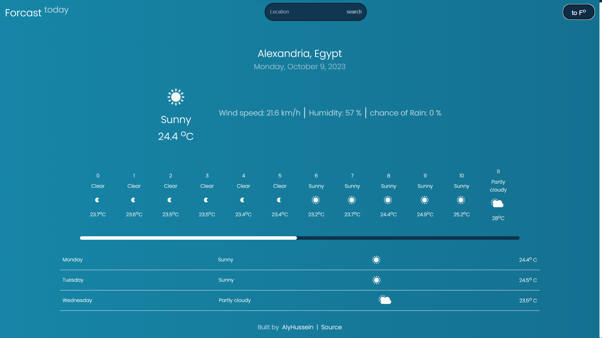

# Weather-app

## features

- Display daily or hourly forecast data for a given location.
- Utilizing geolocation api to display the user location by default.
- Search Location for Forcast data.
- Display Tempreature in Celsius or Fahrenheit.
- Unique weather symbols for each forecast description.

[Live Demo](https://alihussienabdo.github.io/Weather-app/)

## lessons learned

- How to work with apis and fetch Right data from it.
- How to use geolocation to display the user location by default.
- Working with promises and fetch.
- Css animation property.

